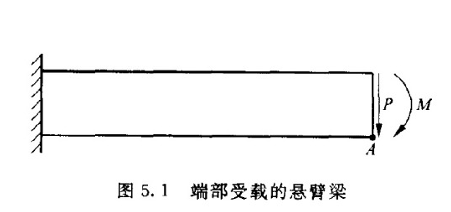
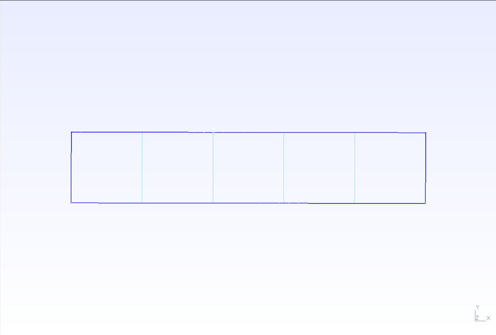
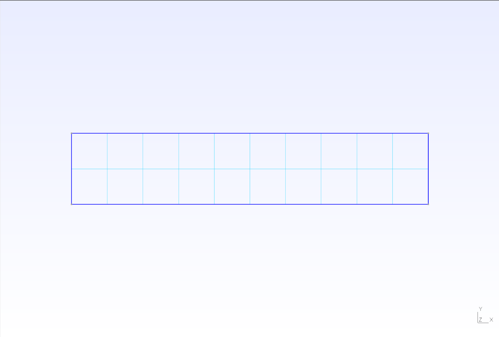
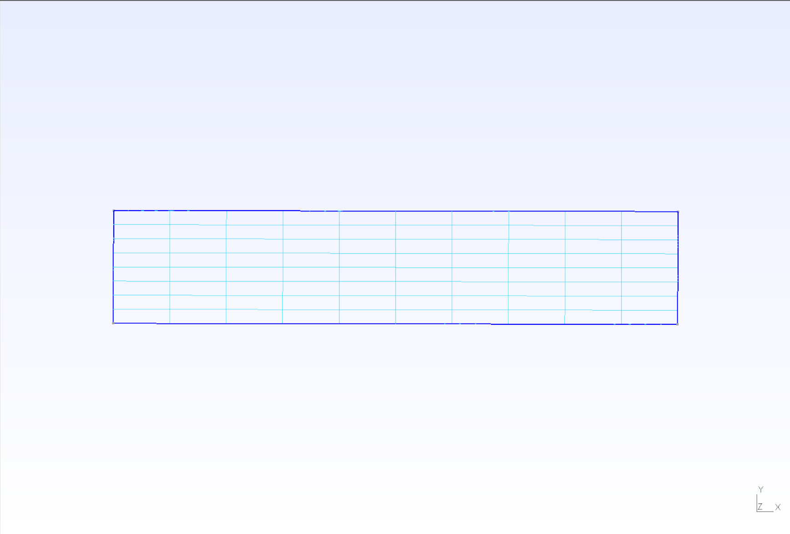
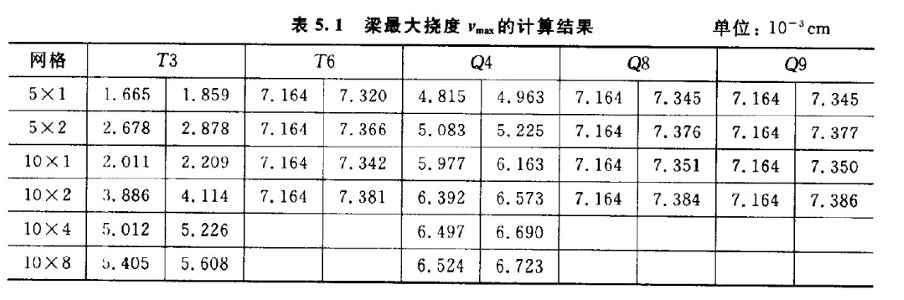
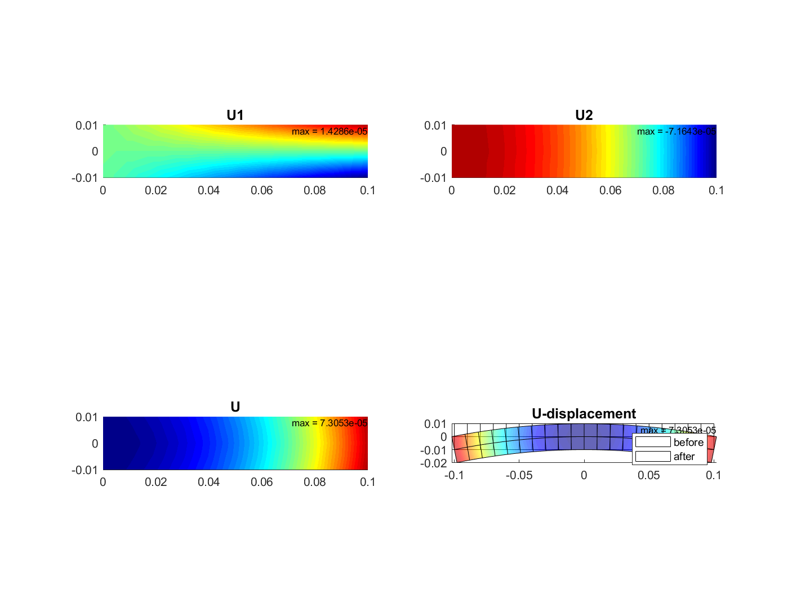

# 悬臂梁有限元计算报告

**姓名：** 雷明城
**学号：** 2022011039	
**日期：** 2025.5.23

---
## 1. 问题描述

### 1.1 模型信息

本报告分析的悬臂梁模型如图所示。



* **梁长 L**: 10 cm
* **梁高 h**: 2 cm
* **梁厚 b**: 1 cm (平面应力问题，通常假设单位厚度或按实际厚度处理应力)
* **材料弹性模量 E**: $2.1 \times 10^5 \text{ MPa}$
* **泊松比 $\nu$**: 0.3

### 1.2 荷载条件

主要考虑以下两种荷载情况：

1.  **端部弯矩 M**: 作用于梁右端，$M = 2000 \text{ N} \cdot \text{cm}$
2.  **端部剪力 P**: 作用于梁右端，$P = 300 \text{ N}$

由于计算程序的限制，只能施加应力场，按照右端$M$按线性分布荷载 $p_z = 1.5 \text{ M*y}$ 加载，$P$按抛物线分布的剪力 $p_y = -0.75P(1-y^2)$加载。

*（此处其实是按材料力学层间无挤压假设解设置的）*

### 1.3 理论解参考

根据教材，在最右端（A点）的最大挠度 $v_{max}$ 理论解为：
* 对于弯矩 M 作用: $v_{max} = 7.164 \times 10^{-3} \text{ cm}$
* 对于剪力 P 作用: $v_{max} = 7.422 \times 10^{-3} \text{ cm}$

理论应力及位移场公式（参考教材图二）：
* **受端部弯矩 M 作用时：**
    * $\sigma_x = \frac{My}{I}$
    * $\sigma_y = 0, \tau_{xy} = 0$
    * $u = \frac{M}{EI}xy$
    * $v = -\frac{M}{2EI}(x^2 + \nu y^2)$
* **受端部剪力 P 作用时：**
    * $\sigma_x = \frac{P(L-x)y}{I}$
    * $\sigma_y = 0$
    * $\tau_{xy} = -\frac{P}{2I}(\frac{h^2}{4} - y^2)$
    * $u = \frac{P}{2EI}(2Lx - x^2)y - \frac{\nu P}{6EI}y^3 + \frac{P}{6IG}y^3$  (注：$G = \frac{E}{2(1+\nu)}$)
    * $v = -\frac{P}{6EI}(3Lx^2 - x^3) - \frac{\nu P}{2EI}(L-x)y^2 - \frac{Ph^2}{8IG}x$ 

---
## 2. 有限元模型

### 2.1 单元类型

本报告主要关注和比较以下平面应力单元：

* **Q4 (4节点四边形单元)**: 双线性位移插值。位移函数包含 $1, x, y, xy$ 项。
* **Q8 (8节点四边形单元)**: 二次位移插值（通常为 serendipity 单元）。位移函数包含 $1, x, y, x^2, xy, y^2, x^2y, xy^2$ 项。
* **Q9 (9节点四边形单元)**: 二次位移插值（Lagrange 单元）。位移函数包含 $1, x, y, x^2, xy, y^2, x^2y, xy^2, x^2y^2$ 项。

### 2.2 网格划分

参照教材图5.2，采用 $N_x \times N_y$ 的网格划分。包括从$5×1$到$10×8$，示例：







### 2.3 边界条件

* **左端固定**: $u=0, v=0$ 对于所有左端节点。

* **右端中性面节点**: 根据图示，中性面节点约束为 $v=0$。

* **荷载施加**:
    * 弯矩M：按线性分布荷载 $p_z = 1.5My$施加在右端节点。
    * 剪力P：按抛物线分布 $p_y = -0.75P(1-y^2)$ 施加在右端节点。
    
    需要注意的是，当网格数较少（例如$5×1$或$10×2$时，剪力将直接采用均布力）

---
## 3. 实现方法

### 在 FEMT 中添加新单元 (9节点网格支持实现总结)

为了在FEMT计算程序**（Fortan版本）**中添加对9节点网格的支持，我们对整个系统的三个主要部分（计算程序、前处理程序和后处理程序）进行了一系列修改。以下是所有修改的详细总结：

#### 3.1 计算程序修改

##### 3.1.1 基础数据定义修改
* **BASIC_DATA.F90**：
    * 将`NUM_ELE_TYPE`常量从4增加到5，以包含新的元素类型。
    ```fortran
    INTEGER(INT_KIND), PARAMETER:: NUM_ELE_TYPE = 5  ! THE TOTAL NUMBER OF ELEMENT TYPES
    ```

##### 3.1.2 元素库初始化修改
* **INIT_ELE_LIB.F90**：
    * 添加了RECTANGLE9元素类型的定义。
    ```fortran
    CASE (5)
       ELEMENT_LIB(I)%ELEMENT_TYPE = 'RECTANGLE9'
       ELEMENT_LIB(I)%NUM_NODE     = 9
       ELEMENT_LIB(I)%NUM_INTP     = 9
       ELEMENT_LIB(I)%DISP_DOF     = 2
       ELEMENT_LIB(I)%NUM_STIFF    = 171
    ```

##### 3.1.3 积分点初始化修改
* **INIT_INTEGRATION.F90**：
    * 修改了积分点初始化，使RECTANGLE9使用与RECTANGLE8相同的积分点。
    ```fortran
    CASE ('RECTANGLE8', 'RECTANGLE9')
       N_GAUSS = 0
       DO I = 1, 3          ! KESI
          DO J = 1, 3       ! ETA
             N_GAUSS = N_GAUSS + 1
             ELEMENT_LIB%INTE_COORD(N_GAUSS)%COORD(1) = GAUSS_COORD3(I)
             ELEMENT_LIB%INTE_COORD(N_GAUSS)%COORD(2) = GAUSS_COORD3(J)
             ELEMENT_LIB%INTE_COORD(N_GAUSS)%WEIGHT   = GAUSS_WEIGHT3(I) * GAUSS_WEIGHT3(J)
          ENDDO
       ENDDO
    ```

##### 3.1.4 形状函数修改
* **SHAPE_2D.F90**：
    
    * 修改了`NODE_SIGN`数组的定义，以正确的顺序和Fortran语法排列9个节点的坐标符号，确保Q4、Q8和Q9单元都能正确索引。角点（1-4）、Q8边中间节点（5-8）和Q9中心节点（9）现在按此顺序排列：
    ```fortran
    REAL(REAL_KIND), PARAMETER::    NODE_SIGN(2,9) = RESHAPE( &
                                    (/ &
                                     -1.0, -1.0,  &  ! Node 1: (-1,-1)
                                      1.0, -1.0,  &  ! Node 2: ( 1,-1)
                                      1.0,  1.0,  &  ! Node 3: ( 1, 1)
                                     -1.0,  1.0,  &  ! Node 4: (-1, 1)
                                      0.0, -1.0,  &  ! Node 5: ( 0,-1) (Q8 midside)
                                      1.0,  0.0,  &  ! Node 6: ( 1, 0) (Q8 midside)
                                      0.0,  1.0,  &  ! Node 7: ( 0, 1) (Q8 midside)
                                     -1.0,  0.0,  &  ! Node 8: (-1, 0) (Q8 midside)
                                      0.0,  0.0   &  ! Node 9: ( 0, 0) (Q9 center)
                                     /), &
                                    (/2, 9/))
    ```
    
    * 添加了9节点元素的形状函数计算，使用标准的Lagrangian多项式方法。
    ```fortran
    ! FOR 9-NODE LAGRANGIAN ELEMENT (Q9)
    IF(NUM_NODE .EQ. 9) THEN
       ! Define 1D Quadratic Lagrangian Polynomials and their derivatives
       ! For nodes at zeta = -1, 0, 1
       L_neg1_ksi = 0.5 * ksi * (ksi - 1.0)
       L_zero_ksi = (1.0 - ksi**2)
       L_pos1_ksi = 0.5 * ksi * (ksi + 1.0)
    
       L_neg1_eta = 0.5 * eta * (eta - 1.0)
       L_zero_eta = (1.0 - eta**2)
       L_pos1_eta = 0.5 * eta * (eta + 1.0)
    
       dL_neg1_ksi = 0.5 * (2.0 * ksi - 1.0)
       dL_zero_ksi = -2.0 * ksi
       dL_pos1_ksi = 0.5 * (2.0 * ksi + 1.0)
    
       dL_neg1_eta = 0.5 * (2.0 * eta - 1.0)
       dL_zero_eta = -2.0 * eta
       dL_pos1_eta = 0.5 * (2.0 * eta + 1.0)
    
       ! Corner Nodes (1-4) - Standard Lagrangian
       ! Node 1: (-1,-1)
       SHAPES(1,I) = L_neg1_ksi * L_neg1_eta
       ! Node 2: (1,-1)
       SHAPES(2,I) = L_pos1_ksi * L_neg1_eta
       ! Node 3: (1,1)
       SHAPES(3,I) = L_pos1_ksi * L_pos1_eta
       ! Node 4: (-1,1)
       SHAPES(4,I) = L_neg1_ksi * L_pos1_eta
    
       ! Mid-side Nodes (5-8) - Standard Lagrangian
       ! Node 5: (0,-1)
       SHAPES(5,I) = L_zero_ksi * L_neg1_eta
       ! Node 6: (1,0)
       SHAPES(6,I) = L_pos1_ksi * L_zero_eta
       ! Node 7: (0,1)
       SHAPES(7,I) = L_zero_ksi * L_pos1_eta
       ! Node 8: (-1,0)
       SHAPES(8,I) = L_neg1_ksi * L_zero_eta
    
       ! Center node (9) - Standard Lagrangian
       SHAPES(9,I) = L_zero_ksi * L_zero_eta ! Equivalent to (1.0 - ksi**2) * (1.0 - eta**2)
    ENDIF
    ```
    
    * 添加了9节点元素的形状函数导数计算（由上推出）。
    ```fortran
    ! FOR 9-NODE LAGRANGIAN ELEMENT (Q9)
    IF(NUM_NODE .EQ. 9) THEN
       ! Define 1D Quadratic Lagrangian Polynomials and their derivatives again for safety / clarity
       ! For nodes at zeta = -1, 0, 1
       L_neg1_ksi = 0.5 * ksi * (ksi - 1.0)
       L_zero_ksi = (1.0 - ksi**2)
       L_pos1_ksi = 0.5 * ksi * (ksi + 1.0)
    
       L_neg1_eta = 0.5 * eta * (eta - 1.0)
       L_zero_eta = (1.0 - eta**2)
       L_pos1_eta = 0.5 * eta * (eta + 1.0)
    
       dL_neg1_ksi = 0.5 * (2.0 * ksi - 1.0)
       dL_zero_ksi = -2.0 * ksi
       dL_pos1_ksi = 0.5 * (2.0 * ksi + 1.0)
    
       dL_neg1_eta = 0.5 * (2.0 * eta - 1.0)
       dL_zero_eta = -2.0 * eta
       dL_pos1_eta = 0.5 * (2.0 * eta + 1.0)
    
       ! Corner Nodes (1-4) - Standard Lagrangian Derivatives
       ! Node 1: (-1,-1)
       D_SHAPE(1,1,I) = dL_neg1_ksi * L_neg1_eta
       D_SHAPE(2,1,I) = L_neg1_ksi * dL_neg1_eta
       ! Node 2: (1,-1)
       D_SHAPE(1,2,I) = dL_pos1_ksi * L_neg1_eta
       D_SHAPE(2,2,I) = L_pos1_ksi * dL_neg1_eta
       ! Node 3: (1,1)
       D_SHAPE(1,3,I) = dL_pos1_ksi * L_pos1_eta
       D_SHAPE(2,3,I) = L_pos1_ksi * dL_pos1_eta
       ! Node 4: (-1,1)
       D_SHAPE(1,4,I) = dL_neg1_ksi * L_pos1_eta
       D_SHAPE(2,4,I) = L_neg1_ksi * dL_pos1_eta
    
       ! Mid-side Nodes (5-8) - Standard Lagrangian Derivatives
       ! Node 5: (0,-1)
       D_SHAPE(1,5,I) = dL_zero_ksi * L_neg1_eta
       D_SHAPE(2,5,I) = L_zero_ksi * dL_neg1_eta
       ! Node 6: (1,0)
       D_SHAPE(1,6,I) = dL_pos1_ksi * L_zero_eta
       D_SHAPE(2,6,I) = L_pos1_ksi * dL_zero_eta
       ! Node 7: (0,1)
       D_SHAPE(1,7,I) = dL_zero_ksi * L_pos1_eta
       D_SHAPE(2,7,I) = L_zero_ksi * dL_pos1_eta
       ! Node 8: (-1,0)
       D_SHAPE(1,8,I) = dL_neg1_ksi * L_zero_eta
       D_SHAPE(2,8,I) = L_neg1_ksi * dL_zero_eta
    
       ! Center node (9) - Standard Lagrangian Derivatives
       D_SHAPE(1,9,I) = dL_zero_ksi * L_zero_eta ! Equivalent to -2.0 * ksi * (1.0 - eta**2)
       D_SHAPE(2,9,I) = L_zero_ksi * dL_zero_eta ! Equivalent to -2.0 * eta * (1.0 - ksi**2)
    ENDIF
    ```

##### 3.1.5 元素读取修改
* **READ_ELEMENTS.F90**：
    * 添加了对RECTANGLE9元素类型的识别。
    ```fortran
    CASE ('RECTANGLE9')
       NUMBER = 5
    ```

##### 3.1.6 形状函数初始化修改
* **INIT_SHAPE.F90**：
    * 在元素类型选择中添加了RECTANGLE9。
    ```fortran
    SELECT CASE(TRIM(ELEMENT_LIB%ELEMENT_TYPE))
       CASE ('TRIANGLE3', 'TRIANGLE6', 'RECTANGLE4', 'RECTANGLE8', 'RECTANGLE9')
          !-- ALLOCATE MEMORY FOR SHAPE FUNCTION --
    ```

##### 3.1.7 力学初始化修改
* **INIT_MECHANICAL.F90**：
    * 在元素类型选择中添加了RECTANGLE9。
    ```fortran
    SELECT CASE(TRIM(P_ELE_TYPE%ELEMENT_TYPE))
       CASE ('TRIANGLE3', 'TRIANGLE6', 'RECTANGLE4', 'RECTANGLE8', 'RECTANGLE9') ! 2D ELEMENTS
          NUM_STRAIN = 3
    ```

##### 3.1.8 刚度矩阵计算修改
* **STIFFNESS.F90**：
    * 在元素类型选择中添加了RECTANGLE9。
    ```fortran
    SELECT CASE(TRIM(ELEMENT_LIB(ELEMENTS(I_ELEMENT)%ELEMENT)%ELEMENT_TYPE))
       CASE ('TRIANGLE3', 'TRIANGLE6', 'RECTANGLE4', 'RECTANGLE8', 'RECTANGLE9')
          CALL STIFFNESS_PLANE(I_ELEMENT, ELEMENT_LIB(ELEMENTS(I_ELEMENT)%ELEMENT)%NUM_NODE, OPTION)
    ```

##### 3.1.9 线力计算修改
* **READ_LINE_FORCE.F90**：
    * 在元素类型选择中添加了RECTANGLE9。
    ```fortran
    SELECT CASE(TRIM(ELE_TYPE))
       CASE ('TRIANGLE3', 'RECTANGLE4')
          NUM_NODE = 2
    
       CASE ('TRIANGLE6', 'RECTANGLE8', 'RECTANGLE9')
          NUM_NODE = 3
    ```

##### 3.1.10 应变计算修改
* **GET_STRAIN.F90**：
    * 在元素类型选择中添加了RECTANGLE9。
    ```fortran
    SELECT CASE(TRIM(ELEMENT_LIB(ELEMENTS(I_ELEMENT)%ELEMENT)%ELEMENT_TYPE))
       CASE ('TRIANGLE3', 'TRIANGLE6', 'RECTANGLE4', 'RECTANGLE8', 'RECTANGLE9')
          CALL STRAIN_GAUSS_PLANE(I_ELEMENT, ELEMENT_LIB(ELEMENTS(I_ELEMENT)%ELEMENT)%NUM_NODE)
    ```

    * 在节点应变计算中添加了RECTANGLE9。
    ```fortran
    SELECT CASE(TRIM(ELEMENT_LIB(ELEMENTS(I_ELEMENT)%ELEMENT)%ELEMENT_TYPE))
       CASE ('TRIANGLE3', 'TRIANGLE6')
          CALL STRAIN_NODAL_TRIANGLE(I_ELEMENT, ELEMENT_LIB(ELEMENTS(I_ELEMENT)%ELEMENT)%NUM_NODE, ADJ_ELE)
    
       CASE ('RECTANGLE4', 'RECTANGLE8', 'RECTANGLE9')
          CALL STRAIN_NODAL_RECTANGLE(I_ELEMENT, ELEMENT_LIB(ELEMENTS(I_ELEMENT)%ELEMENT)%NUM_NODE, ADJ_ELE)
    ```

##### 3.1.11 应力计算修改
* **GET_STRESS.F90**：
    * 在元素类型选择中添加了RECTANGLE9。
    ```fortran
    SELECT CASE(TRIM(ELEMENT_LIB(ELEMENTS(I_ELEMENT)%ELEMENT)%ELEMENT_TYPE))
       CASE ('TRIANGLE3', 'TRIANGLE6', 'RECTANGLE4', 'RECTANGLE8', 'RECTANGLE9')
          CALL STRESS_GAUSS_PLANE(I_ELEMENT, ELEMENT_LIB(ELEMENTS(I_ELEMENT)%ELEMENT)%NUM_INTP, OPTION(2))
    ```

    * 在节点应力计算中添加了RECTANGLE9。
    ```fortran
    SELECT CASE(TRIM(ELEMENT_LIB(ELEMENTS(I_ELEMENT)%ELEMENT)%ELEMENT_TYPE))
       CASE ('TRIANGLE3', 'TRIANGLE6')
          CALL STRESS_NODAL_TRIANGLE(I_ELEMENT, ELEMENT_LIB(ELEMENTS(I_ELEMENT)%ELEMENT)%NUM_NODE, ADJ_ELE, OPTION(2))
    
       CASE ('RECTANGLE4', 'RECTANGLE8', 'RECTANGLE9')
          CALL STRESS_NODAL_RECTANGLE(I_ELEMENT, ELEMENT_LIB(ELEMENTS(I_ELEMENT)%ELEMENT)%NUM_NODE, ADJ_ELE, OPTION(2))
    ```

##### 3.1.12 力计算修改
* **GET_FORCE.F90**：
    * 在元素类型选择中添加了RECTANGLE9。
    ```fortran
    SELECT CASE(TRIM(ELEMENT_LIB(ELE_TYPE)%ELEMENT_TYPE))
       CASE ('TRIANGLE3', 'RECTANGLE4')
          CALL LINE_FORCE_PLANE(LINE_FORCE(I), 2)
    
       CASE ('TRIANGLE6', 'RECTANGLE8', 'RECTANGLE9')
          CALL LINE_FORCE_PLANE(LINE_FORCE(I), 3)
    ```

#### 3.2 前处理程序修改

##### 3.2.1 元素类型处理修改
* **pre_process.m**：
    * 添加了对9节点元素的支持。
    ```matlab
    case 9
        ELEMTYPE = 'RECTANGLE9';
        fprintf(ctr,  '       1 TO  %d  TYPE %s\r\n',elem_num,ELEMTYPE);
        fprintf(ctr,  '    END ELEMENT_TYPE\r\n');
        fprintf(ctr, '\r\n');
        fprintf(ctr,  '    ELEMENT_NODES\r\n');
        for i = 1:elem_num
            fprintf(ctr,'%8d    %6d    %6d    %6d    %6d    %6d    %6d    %6d    %6d    %6d\r\n',...
                i,t(i,1),t(i,2),t(i,3),t(i,4),t(i,5),t(i,6),t(i,7),t(i,8),t(i,9));
        end
        fprintf(ctr, '\r\n');
    ```

##### 3.2.2 调试信息修改
* **pre_process.m**：
    * 添加了对9节点元素的调试信息。
    ```matlab
    if length(t(1,:)) == 4
        fprintf('Debug: Should use RECTANGLE4\n');
    elseif length(t(1,:)) == 8
        fprintf('Debug: Should use RECTANGLE8\n');
    elseif length(t(1,:)) == 9
        fprintf('Debug: Should use RECTANGLE9\n');
    elseif length(t(1,:)) == 3
        fprintf('Debug: Should use TRIANGLE3\n');
    elseif length(t(1,:)) == 6
        fprintf('Debug: Should use TRIANGLE6\n');
    else
        fprintf('Debug: WARNING - No matching element type for length(t(1,:)) = %d\n', length(t(1,:)));
    ```

##### 3.2.3 力的应用修改
* **pre_process.m**：
    * 修改了力的应用部分以支持9节点元素。
    ```matlab
    if length(t(1,:)) == 4 || length(t(1,:)) == 3
        fprintf(bnd,'             %6d    SIDE    %6d    %6d    F_N     %4.1f    %4.1f\r\n',...
        Fset(i,1), Fset(i,2), Fset(i,3), Pa, Pa);
    elseif  length(t(1,:)) == 6 || length(t(1,:)) == 8 || length(t(1,:)) == 9
        fprintf(bnd,'             %6d    SIDE    %6d    %6d    %6d    F_N     %4.1f    %4.1f    %4.1f\r\n',...
        Fset(i,1), Fset(i,2), Fset(i,3), Fset(i,4) ,Pa , Pa, Pa);
    end
    ```

#### 3.3 后处理程序修改

##### 3.3.1 元素连接矩阵处理修改
* **post_process.m**：
    * 添加了对9节点元素的支持。
    ```matlab
    [m, u] = size(tt);
    if u == 6
        tt = [tt(:, 1), tt(:, 4), tt(:, 2), tt(:, 5), tt(:, 3), tt(:, 6)];
    elseif u == 8
        tt = [tt(:, 1), tt(:, 5), tt(:, 2), tt(:, 6), tt(:, 3), tt(:, 7), tt(:, 4), tt(:, 8)];
    elseif u == 9
        % 对于9节点元素，我们需要重新排列节点以便正确绘制
        % 9节点元素的节点顺序：4个角点，4个中点，1个中心点
        % 为了绘图，我们只使用8个外部节点，忽略中心节点
        tt = [tt(:, 1), tt(:, 5), tt(:, 2), tt(:, 6), tt(:, 3), tt(:, 7), tt(:, 4), tt(:, 8)];
    end
    ```

##### 3.3.2 添加网格信息显示功能
* **post_process.m**：
    * 添加了网格信息显示功能。
    ```matlab
    % 显示网格信息
    if show_mesh_info
        [m, u] = size(T(:,2:end));
        fprintf('\n网格信息:\n');
        fprintf('节点数: %d\n', size(P, 1));
        fprintf('单元数: %d\n', m);
    
        % 确定元素类型
        if u == 3
            fprintf('元素类型: TRIANGLE3 (3节点三角形)\n');
        elseif u == 4
            fprintf('元素类型: RECTANGLE4 (4节点四边形)\n');
        elseif u == 6
            fprintf('元素类型: TRIANGLE6 (6节点三角形)\n');
        elseif u == 8
            fprintf('元素类型: RECTANGLE8 (8节点四边形)\n');
        elseif u == 9
            fprintf('元素类型: RECTANGLE9 (9节点四边形)\n');
        else
            fprintf('元素类型: 未知 (%d节点)\n', u);
        end
        fprintf('\n');
    end
    ```

#### 3.4 修改总结

通过以上修改，我们成功地为FEMT有限元分析系统添加了对9节点网格的支持。这些修改涵盖了系统的三个主要部分：

1.计算程序：加入九节点形函数与导数（高斯积分与八节点采用相同设置），并相应对九节点网格的支持；

2.前后处理程序：加入对九节点单元的识别与支持；

*除上述修改之外，还修改了一些语法，使得程序支持gfortran编译*

---
## 4. 计算结果与分析

### 4.1 位移结果

本节展示在悬臂梁自由端A点计算得到的最大竖向位移 $v_{max}$。**计算结果的单位统一为 $10^{-3} \text{ cm}$**。

下表展示了在不同网格密度和单元类型下，分别在端部弯矩 M 作用和端部剪力 P 作用时的计算值。

理论解参考值：
* 端部弯矩 M 作用: $v_{max,理论} = 7.164 \times 10^{-3} \text{ cm}$
* 端部剪力 P 作用: $v_{max,理论} = 7.422 \times 10^{-3} \text{ cm}$

#### 4.1.1 最大挠度 $v_{max}$ 计算结果 (单位: $10^{-3}$ cm)
*(表中格式为：弯矩 M 作用结果 / 剪力 P 作用结果)*

| 网格密度      | Q4 ($v_M / v_P$) | Q8 ($v_M / v_P$) | Q9 ($v_M / v_P$) |
| :------------ | :--------------- | :--------------- | :--------------- |
| $5 \times 1$  | 4.815 / 4.952    | 7.081 / 7.302    | 7.143 / 7.308    |
| $5 \times 2$  | 5.068 / 5.193    | 7.164 / 7.376    | 7.159 / 7.363    |
| $10 \times 1$ | 5.977 / 6.148    | 7.143 / 7.313    | 7.143 / 7.321    |
| $10 \times 2$ | 6.373 / 6.535    | 7.159 / 7.369    | 7.164 / 7.386    |
| $10 \times 4$ | 6.497 / 6.692    | N/A  /  N/A      | N/A  /  N/A      |
| $10 \times 8$ | 6.513 / 6.702    | N/A  /  N/A      | N/A  /  N/A      |

*N/A 表示数据未提供*

对比书中计算结果，均较为接近：



---

#### 4.1.2 计算结果与理论解的误差分析

为了更清晰地评估计算精度，下面将分别对弯矩 M 作用和剪力 P 作用下的计算结果进行误差分析。表格将按单元类型（Q4, Q8, Q9）组织，以便于比较不同单元在各种网格密度下的表现。

**1. 端部弯矩 M 作用 ($v_{M,理论} = 7.164 \times 10^{-3} \text{ cm}$)**

**Q4 单元 (弯矩 M 作用)**
|   网格密度    | 计算值 ($10^{-3}$ cm) | 理论值 ($10^{-3}$ cm) | 相对误差 (%) |
| :-----------: | :-------------------: | :-------------------: | :----------: |
| $5 \times 1$  |         4.815         |         7.164         |    32.79%    |
| $5 \times 2$  |         5.068         |         7.164         |    29.26%    |
| $10 \times 1$ |         5.977         |         7.164         |    16.57%    |
| $10 \times 2$ |         6.373         |         7.164         |    11.04%    |
| $10 \times 4$ |         6.497         |         7.164         |    9.31%     |
| $10 \times 8$ |         6.513         |         7.164         |    9.09%     |

**Q8 单元 (弯矩 M 作用)**
|   网格密度    | 计算值 ($10^{-3}$ cm) | 理论值 ($10^{-3}$ cm) | 相对误差 (%) |
| :-----------: | :-------------------: | :-------------------: | :----------: |
| $5 \times 1$  |         7.081         |         7.164         |    1.16%     |
| $5 \times 2$  |         7.164         |         7.164         |    0.00%     |
| $10 \times 1$ |         7.143         |         7.164         |    0.29%     |
| $10 \times 2$ |         7.159         |         7.164         |    0.07%     |
| $10 \times 4$ |          N/A          |         7.164         |     N/A      |
| $10 \times 8$ |          N/A          |         7.164         |     N/A      |

**Q9 单元 (弯矩 M 作用)**
|   网格密度    | 计算值 ($10^{-3}$ cm) | 理论值 ($10^{-3}$ cm) | 相对误差 (%) |
| :-----------: | :-------------------: | :-------------------: | :----------: |
| $5 \times 1$  |         7.143         |         7.164         |    0.29%     |
| $5 \times 2$  |         7.159         |         7.164         |    0.07%     |
| $10 \times 1$ |         7.143         |         7.164         |    0.29%     |
| $10 \times 2$ |         7.164         |         7.164         |    0.00%     |
| $10 \times 4$ |          N/A          |         7.164         |     N/A      |
| $10 \times 8$ |          N/A          |         7.164         |     N/A      |

*N/A 表示数据未提供*

---

**2. 端部剪力 P 作用 ($v_{P,理论} = 7.422 \times 10^{-3} \text{ cm}$)**

**Q4 单元 (剪力 P 作用)**
|   网格密度    | 计算值 ($10^{-3}$ cm) | 理论值 ($10^{-3}$ cm) | 相对误差 (%) |
| :-----------: | :-------------------: | :-------------------: | :----------: |
| $5 \times 1$  |         4.952         |         7.422         |    33.28%    |
| $5 \times 2$  |         5.193         |         7.422         |    30.03%    |
| $10 \times 1$ |         6.148         |         7.422         |    17.16%    |
| $10 \times 2$ |         6.535         |         7.422         |    11.95%    |
| $10 \times 4$ |         6.692         |         7.422         |    9.84%     |
| $10 \times 8$ |         6.702         |         7.422         |    9.70%     |

**Q8 单元 (剪力 P 作用)**
|   网格密度    | 计算值 ($10^{-3}$ cm) | 理论值 ($10^{-3}$ cm) | 相对误差 (%) |
| :-----------: | :-------------------: | :-------------------: | :----------: |
| $5 \times 1$  |         7.302         |         7.422         |    1.62%     |
| $5 \times 2$  |         7.376         |         7.422         |    0.62%     |
| $10 \times 1$ |         7.313         |         7.422         |    1.47%     |
| $10 \times 2$ |         7.369         |         7.422         |    0.71%     |
| $10 \times 4$ |          N/A          |         7.422         |     N/A      |
| $10 \times 8$ |          N/A          |         7.422         |     N/A      |

**Q9 单元 (剪力 P 作用)**
|   网格密度    | 计算值 ($10^{-3}$ cm) | 理论值 ($10^{-3}$ cm) | 相对误差 (%) |
| :-----------: | :-------------------: | :-------------------: | :----------: |
| $5 \times 1$  |         7.308         |         7.422         |    1.54%     |
| $5 \times 2$  |         7.363         |         7.422         |    0.80%     |
| $10 \times 1$ |         7.321         |         7.422         |    1.36%     |
| $10 \times 2$ |         7.386         |         7.422         |    0.49%     |
| $10 \times 4$ |          N/A          |         7.422         |     N/A      |
| $10 \times 8$ |          N/A          |         7.422         |     N/A      |

*N/A 表示数据未提供*

---

#### 4.1.3 位移云图 

以$10*2$的剪力载荷和弯矩载荷做例子：

弯矩载荷：



剪力载荷：


### 4.2 讨论与分析

* 分析不同单元类型（Q4, Q8, Q9）在不同网格密度下位移和应力结果的精度。哪种单元类型在当前问题和网格密度下表现最好？为什么？

  Q4单元因为仅包含 $xy$ 项，所以对真实弯曲场的描述有偏差，精度较差；Q8和Q9单元则包含二次项，理论上对于弯矩作用的位移场能够完整描述；但对于剪力情况，由于缺少三次项，所以仍有一定误差。

* 分析误差来源。

  除了上述的单元格式自带的误差项，边界等效载荷是误差的主要来源（可能是二次单元在较稀疏网格时无法完全计算准确的原因），如果采用更精确的等效力场（比如上下边界施加剪力来模拟弯矩），可能会有更精确的结果。

